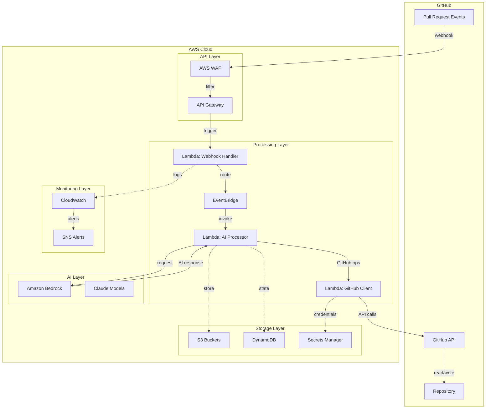

# Design Document: AutoDev AI AWS

## Overview

AutoDev AI AWS is a serverless, event-driven AI system built entirely on AWS managed services that integrates with GitHub repositories to provide automatic pull request analysis, documentation maintenance, and intelligent code review. The system leverages AWS's pay-per-use model, enterprise-grade security, and automatic scaling to deliver cost-effective automation without operational overhead.

The architecture follows AWS Well-Architected Framework principles with emphasis on cost optimization, operational excellence, and security. All components are serverless or managed services, eliminating infrastructure management while providing enterprise-scale reliability and performance.

## Architecture

### High-Level AWS Architecture



### Serverless Component Architecture

The system consists of AWS managed services with no infrastructure to maintain:

1. **API Gateway + WAF**: Secure webhook endpoint with DDoS protection and rate limiting
2. **Lambda Functions**: Serverless compute for webhook processing, AI analysis, and GitHub operations
3. **EventBridge**: Event routing and orchestration between Lambda functions
4. **Amazon Bedrock**: Managed AI service for code analysis using foundation models
5. **DynamoDB**: Serverless database for state management and bot loop prevention
6. **S3**: Object storage for artifacts, logs, and large processing data
7. **Secrets Manager**: Secure credential storage for GitHub App authentication
8. **CloudWatch**: Comprehensive monitoring, logging, and alerting

### Cost Optimization Architecture

The design prioritizes cost efficiency through:
- **Pay-per-use pricing**: No idle costs, only pay for actual processing
- **Intelligent model selection**: Use appropriate Bedrock models based on task complexity
- **Efficient processing**: Batch operations and minimize AI API calls
- **Automatic scaling**: Scale to zero when not in use
- **Lifecycle management**: Automatic cleanup of temporary data and logs

## Components and Interfaces

### API Gateway + WAF Component

**Responsibilities:**
- Receive GitHub webhook events securely
- Validate webhook signatures and rate limit requests
- Protect against DDoS and malicious traffic
- Route validated requests to Lambda functions

**Configuration:**
```yaml
APIGateway:
  Type: REST
  Authentication: None (webhook signature validation in Lambda)
  RateLimit: 1000 requests/minute per IP
  CORS: Disabled
  Logging: Full request/response logging to CloudWatch

WAF:
  Rules:
    - Rate limiting: 100 requests/minute per IP
    - Geographic restrictions: Optional
    - Known bad IPs: AWS managed rule set
    - Size restrictions: 1MB max payload
```

**Key Operations:**
- Webhook signature pre-validation
- Request size and rate limiting
- Security event logging
- Integration with Lambda via proxy integration

### Lambda Webhook Handler Component

**Responsibilities:**
- Validate GitHub webhook signatures
- Parse and filter PR events
- Route events to EventBridge for processing
- Implement bot loop detection

**Interface:**
```python
# Lambda function handler
def lambda_handler(event, context):
    webhook_data = parse_api_gateway_event(event)
    if validate_github_signature(webhook_data):
        pr_event = extract_pr_event(webhook_data)
        if should_process_event(pr_event):
            route_to_eventbridge(pr_event)
    return success_response()

# Core functions
def validate_github_signature(webhook_data: dict) -> bool
def extract_pr_event(webhook_data: dict) -> PREvent
def should_process_event(pr_event: PREvent) -> bool
def route_to_eventbridge(pr_event: PREvent) -> None
```

**AWS Configuration:**
- Runtime: Python 3.11
- Memory: 256 MB
- Timeout: 30 seconds
- Environment: GitHub webhook secret from Secrets Manager
- IAM: EventBridge PutEvents, Secrets Manager GetSecretValue, CloudWatch Logs

### EventBridge Router Component

**Responsibilities:**
- Route events to appropriate Lambda processors
- Implement event filtering and transformation
- Provide retry logic and dead letter queues
- Enable event replay for debugging

**Event Rules:**
```json
{
  "Rules": [
    {
      "Name": "PRAnalysisRule",
      "EventPattern": {
        "source": ["autodev.webhook"],
        "detail-type": ["PR Event"],
        "detail": {
          "action": ["opened", "synchronize"]
        }
      },
      "Targets": ["AIProcessorLambda"]
    },
    {
      "Name": "PRClosedRule", 
      "EventPattern": {
        "source": ["autodev.webhook"],
        "detail-type": ["PR Event"],
        "detail": {
          "action": ["closed"]
        }
      },
      "Targets": ["CleanupLambda"]
    }
  ]
}
```

**Key Operations:**
- Event pattern matching and filtering
- Automatic retry with exponential backoff
- Dead letter queue for failed events
- Event archiving and replay capabilities

### Lambda AI Processor Component

**Responsibilities:**
- Analyze pull request diffs using Amazon Bedrock
- Generate summaries, documentation updates, and code feedback
- Coordinate with GitHub Client Lambda for repository operations
- Manage processing state in DynamoDB

**Interface:**
```python
def lambda_handler(event, context):
    pr_data = extract_pr_data_from_event(event)
    analysis_result = analyze_with_bedrock(pr_data)
    store_processing_state(pr_data.pr_id, analysis_result)
    invoke_github_client(analysis_result)
    return processing_summary()

# Core AI processing functions
def analyze_with_bedrock(pr_data: PRData) -> AnalysisResult
def generate_summary(diff: str, metadata: PRMetadata) -> str
def detect_doc_updates_needed(changes: List[FileChange]) -> List[DocUpdate]
def generate_code_feedback(changes: List[FileChange]) -> List[Feedback]
def store_processing_state(pr_id: str, result: AnalysisResult) -> None
```

**AWS Configuration:**
- Runtime: Python 3.11
- Memory: 1024 MB (for large diff processing)
- Timeout: 5 minutes
- Environment: Bedrock model configuration
- IAM: Bedrock InvokeModel, DynamoDB PutItem/GetItem, Lambda InvokeFunction, S3 GetObject/PutObject

### Amazon Bedrock Integration

**Responsibilities:**
- Provide AI model access for code analysis
- Handle context window management
- Optimize model selection based on task complexity
- Manage token usage and costs

**Model Selection Strategy:**
```python
def select_optimal_model(task_type: str, content_size: int) -> str:
    if task_type == "summary" and content_size < 10000:
        return "anthropic.claude-3-haiku-20240307-v1:0"  # Fast, cost-effective
    elif task_type == "code_review" or content_size > 50000:
        return "anthropic.claude-3-sonnet-20240229-v1:0"  # Balanced performance
    elif task_type == "complex_analysis":
        return "anthropic.claude-3-opus-20240229-v1:0"    # Highest capability
    else:
        return "anthropic.claude-3-haiku-20240307-v1:0"   # Default to cost-effective
```

**Key Operations:**
- Dynamic model selection based on content and task
- Context window optimization and chunking
- Token usage tracking and cost monitoring
- Error handling and fallback strategies

### Lambda GitHub Client Component

**Responsibilities:**
- Authenticate with GitHub API using stored credentials
- Fetch pull request data and diffs
- Post comments and commit documentation updates
- Manage GitHub API rate limiting

**Interface:**
```python
def lambda_handler(event, context):
    github_operations = extract_operations_from_event(event)
    github_client = create_authenticated_client()
    results = execute_github_operations(github_client, github_operations)
    return operation_results(results)

# GitHub API operations
def create_authenticated_client() -> GitHubClient
def get_pr_diff(repo: str, pr_number: int) -> str
def post_pr_comment(repo: str, pr_number: int, comment: str) -> None
def update_documentation(repo: str, branch: str, updates: List[DocUpdate]) -> None
def check_bot_commit(commit_sha: str) -> bool
```

**AWS Configuration:**
- Runtime: Python 3.11
- Memory: 512 MB
- Timeout: 2 minutes
- Environment: GitHub API endpoints
- IAM: Secrets Manager GetSecretValue, DynamoDB PutItem, CloudWatch Logs

### DynamoDB State Management

**Responsibilities:**
- Track processing history and prevent bot loops
- Store temporary processing state
- Manage automatic data cleanup with TTL
- Provide fast lookups for bot commit detection

**Table Schema:**
```python
# Bot Commits Table
{
    "TableName": "autodev-bot-commits",
    "KeySchema": [
        {"AttributeName": "commit_sha", "KeyType": "HASH"}
    ],
    "AttributeDefinitions": [
        {"AttributeName": "commit_sha", "AttributeType": "S"}
    ],
    "TimeToLiveSpecification": {
        "AttributeName": "ttl",
        "Enabled": True
    }
}

# Processing State Table  
{
    "TableName": "autodev-processing-state",
    "KeySchema": [
        {"AttributeName": "pr_id", "KeyType": "HASH"}
    ],
    "AttributeDefinitions": [
        {"AttributeName": "pr_id", "AttributeType": "S"}
    ],
    "TimeToLiveSpecification": {
        "AttributeName": "ttl", 
        "Enabled": True
    }
}
```

**Key Operations:**
- Fast commit SHA lookups for bot loop prevention
- Processing state persistence across Lambda invocations
- Automatic cleanup of old records (30-day TTL)
- Conditional writes to prevent race conditions

### S3 Storage Component

**Responsibilities:**
- Store large PR diffs that exceed Lambda memory limits
- Archive processing logs and artifacts
- Provide temporary storage for multi-step processing
- Implement lifecycle policies for cost optimization

**Bucket Configuration:**
```yaml
Buckets:
  ProcessingArtifacts:
    Name: autodev-processing-artifacts-{account-id}
    Versioning: Disabled
    Encryption: AES256
    LifecyclePolicy:
      - DeleteAfter: 30 days
      - TransitionToIA: 7 days
    
  SystemLogs:
    Name: autodev-system-logs-{account-id}
    Versioning: Disabled
    Encryption: AES256
    LifecyclePolicy:
      - DeleteAfter: 90 days
      - TransitionToIA: 30 days
```

**Key Operations:**
- Temporary storage for large diffs during processing
- Log aggregation and long-term storage
- Artifact storage for debugging and analysis
- Cost-optimized storage classes and lifecycle management

## Data Models

### Core Data Structures

**PREvent (EventBridge Event):**
```python
@dataclass
class PREvent:
    source: str = "autodev.webhook"
    detail_type: str = "PR Event"
    detail: PREventDetail
    
@dataclass
class PREventDetail:
    action: str  # opened, updated, synchronized, closed
    repository: Repository
    pull_request: PullRequest
    sender: User
    installation_id: int
    timestamp: str
```

**PRData (Processing Context):**
```python
@dataclass
class PRData:
    repo_name: str
    pr_number: int
    pr_id: str  # unique identifier for DynamoDB
    branch_name: str
    base_branch: str
    author: str
    title: str
    description: str
    files_changed: List[str]
    diff_s3_key: Optional[str]  # for large diffs stored in S3
    installation_id: int
```

**AnalysisResult:**
```python
@dataclass
class AnalysisResult:
    pr_id: str
    summary: str
    doc_updates: List[DocUpdate]
    feedback_items: List[Feedback]
    processing_time: float
    bedrock_model_used: str
    token_usage: int
    cost_estimate: float
    timestamp: str
```

**BedrockRequest:**
```python
@dataclass
class BedrockRequest:
    model_id: str
    prompt: str
    max_tokens: int
    temperature: float
    system_prompt: str
    
@dataclass
class BedrockResponse:
    content: str
    token_usage: TokenUsage
    model_id: str
    finish_reason: str
```

### AWS Service Integration Models

**SecretsManagerConfig:**
```python
@dataclass
class GitHubAppSecrets:
    app_id: int
    private_key: str
    webhook_secret: str
    installation_token: str
    
def get_github_secrets() -> GitHubAppSecrets:
    secrets_client = boto3.client('secretsmanager')
    secret_value = secrets_client.get_secret_value(
        SecretId='autodev/github-app-credentials'
    )
    return GitHubAppSecrets(**json.loads(secret_value['SecretString']))
```

**DynamoDBModels:**
```python
@dataclass
class BotCommitRecord:
    commit_sha: str  # partition key
    repository: str
    pr_number: int
    timestamp: str
    ttl: int  # 30 days from creation
    
@dataclass
class ProcessingStateRecord:
    pr_id: str  # partition key
    status: str  # processing, completed, failed
    analysis_result: Optional[AnalysisResult]
    error_message: Optional[str]
    timestamp: str
    ttl: int  # 7 days from creation
```

### Configuration and Environment Models

**LambdaEnvironment:**
```python
@dataclass
class LambdaConfig:
    # From environment variables
    github_secrets_arn: str
    bedrock_region: str
    dynamodb_table_prefix: str
    s3_bucket_prefix: str
    eventbridge_bus_name: str
    log_level: str
    
    # Derived from Secrets Manager
    github_app_id: int
    github_private_key: str
    webhook_secret: str
```

**BedrockConfig:**
```python
@dataclass
class BedrockConfig:
    default_model: str = "anthropic.claude-3-haiku-20240307-v1:0"
    max_tokens: int = 4000
    temperature: float = 0.1
    region: str = "us-east-1"
    
    # Model selection thresholds
    haiku_max_tokens: int = 10000
    sonnet_max_tokens: int = 50000
    opus_min_complexity: float = 0.8
```

## Correctness Properties

*A property is a characteristic or behavior that should hold true across all valid executions of a system—essentially, a formal statement about what the system should do. Properties serve as the bridge between human-readable specifications and machine-verifiable correctness guarantees.*

Based on the prework analysis, I'll now convert the testable acceptance criteria into correctness properties. After reviewing all properties identified as testable, I can consolidate some redundant properties:

**Property Reflection:**
- Properties 1.1 and 5.1 both test webhook event flow - can be combined
- Properties 2.2, 2.3, 2.4 all test documentation updates - can be combined into comprehensive property
- Properties 3.1, 3.2, 3.3 all test code quality feedback - can be combined
- Properties 6.1, 6.2, 6.3 all test bot loop prevention - can be combined
- Properties 8.1, 8.2, 8.3, 8.4 all test AWS service integration - can be combined where logical

### Property 1: Webhook Event Processing Flow
*For any* pull request event (opened, updated, synchronized), the AutoDev_AWS_System should receive the webhook via API_Gateway, validate it, route it through EventBridge_Router, and trigger the appropriate Lambda_Processor for analysis.
**Validates: Requirements 1.1, 5.1, 5.2**

### Property 2: AI Analysis and Summary Generation
*For any* pull request diff, the Bedrock_AI should analyze it using appropriate Claude models to generate a human-readable summary that identifies what changed, why it matters, and which system components are affected.
**Validates: Requirements 1.2**

### Property 3: Summary Posting Consistency
*For any* generated summary, the Lambda_Processor should post it as a Bot_Comment on the corresponding pull request via GitHub API.
**Validates: Requirements 1.3**

### Property 4: Large Diff Context Window Handling
*For any* pull request diff within the selected Bedrock model's context window limits, the AutoDev_AWS_System should process it without errors or truncation.
**Validates: Requirements 1.4, 7.2**

### Property 5: Comprehensive Documentation Updates
*For any* code changes that impact public APIs, core modules, configuration files, or public interfaces, the Lambda_Processor should detect these changes using Bedrock_AI analysis and update README.md and relevant documentation files with commits to the pull request branch.
**Validates: Requirements 2.1, 2.2, 2.3, 2.4**

### Property 6: Unnecessary Commit Prevention
*For any* pull request that doesn't require documentation updates, the AutoDev_AWS_System should not create commits.
**Validates: Requirements 2.5**

### Property 7: Comprehensive Code Quality Analysis
*For any* pull request with code quality issues (risky logic patterns, complexity, duplication, unclear code), the Bedrock_AI should detect these issues and the Lambda_Processor should post context-aware Bot_Comments with high-level design feedback that avoids linting-style comments and focuses on design concerns.
**Validates: Requirements 3.1, 3.2, 3.3, 3.5**

### Property 8: Clean Code Silence
*For any* pull request with no significant code quality issues, the AutoDev_AWS_System should not post unnecessary feedback comments.
**Validates: Requirements 3.4**

### Property 9: Secure Authentication with Secrets Manager
*For any* GitHub API operation, the AutoDev_AWS_System should authenticate using GitHub_App credentials retrieved from Secrets_Manager and use proper authentication tokens.
**Validates: Requirements 4.1, 4.5**

### Property 10: Event Processing and Diff Fetching
*For any* PR event processing, the Lambda_Processor should fetch PR diffs via the GitHub API and process changes autonomously without requiring manual input or chat-based interaction.
**Validates: Requirements 5.3, 5.4**

### Property 11: Error Resilience and Logging
*For any* system errors encountered during processing (AI failures, GitHub API errors, etc.), the CloudWatch_Monitor should log them and the system should continue operating for subsequent events without blocking the pull request workflow.
**Validates: Requirements 5.5, 7.4**

### Property 12: Comprehensive Bot Loop Prevention
*For any* PR event, the Lambda_Processor should check DynamoDB_State to determine if the triggering commit was made by the bot itself, skip processing bot-generated events, record documentation commits in DynamoDB_State as bot-generated, and maintain records with TTL for automatic cleanup.
**Validates: Requirements 6.1, 6.2, 6.3, 6.4**

### Property 13: Rate Limiting Fallback
*For any* situation where loop detection fails, the EventBridge_Router should implement rate limiting as a fallback mechanism to prevent infinite loops.
**Validates: Requirements 6.5**

### Property 14: Optimal Model Selection and Processing Efficiency
*For any* pull request analysis, the Bedrock_AI should select appropriate models based on task complexity and content size, handle context windows for typical PR sizes, and generate summaries, documentation updates, and feedback in single processing passes when possible to minimize AI API calls and costs.
**Validates: Requirements 7.1, 7.3, 7.5**

### Property 15: AWS Service Integration and Lifecycle Management
*For any* system operation, the S3_Storage should store processing artifacts with appropriate lifecycle policies, DynamoDB_State should track processing history with automatic TTL cleanup, and CloudWatch_Monitor should provide centralized logging and metrics for all system components.
**Validates: Requirements 8.1, 8.2, 8.4**

### Property 16: Secure Credential Management
*For any* sensitive data access, the Secrets_Manager should securely store and provide GitHub App credentials, API keys, and other sensitive configuration.
**Validates: Requirements 8.3**

### Property 17: Automatic Scaling and Load Handling
*For any* increased load or scaling event, the AutoDev_AWS_System should handle it automatically through AWS managed service scaling, with Lambda_Processor scaling based on webhook volume without pre-provisioned capacity.
**Validates: Requirements 8.5, 9.2**

### Property 18: Multi-Repository Support
*For any* repository installation, the AutoDev_AWS_System should support multiple repositories through separate GitHub App installations.
**Validates: Requirements 9.1**

### Property 19: Cost Control and Optimization
*For any* processing operation, the AutoDev_AWS_System should implement cost controls through Bedrock model selection and processing optimization, with CloudWatch_Monitor tracking usage metrics and costs for billing transparency.
**Validates: Requirements 9.3, 9.4**

### Property 20: Enterprise Configuration Flexibility
*For any* enterprise feature requirement, the AutoDev_AWS_System should provide clear configuration options for advanced capabilities.
**Validates: Requirements 9.5**

### Property 21: Security Best Practices and IAM
*For any* AWS service interaction, the AutoDev_AWS_System should use IAM roles and policies with least-privilege access, with API_Gateway validating webhook signatures and implementing rate limiting to prevent abuse.
**Validates: Requirements 10.1, 10.2**

### Property 22: Network Security and VPC Configuration
*For any* security requirement, the Lambda_Processor should run in VPC when required for network isolation and security.
**Validates: Requirements 10.3**

### Property 23: Data Encryption and Security Logging
*For any* data storage or security event, the S3_Storage should use encryption at rest and in transit for all stored data, and CloudWatch_Monitor should log all security-relevant events for audit and compliance purposes.
**Validates: Requirements 10.4, 10.5**

<function_calls>
<invoke name="prework">
<parameter name="featureName">autodev-ai-aws

## Error Handling

### AWS-Native Error Handling Strategy

The AutoDev AI AWS system leverages AWS managed services for comprehensive error handling, monitoring, and recovery. All error handling follows AWS Well-Architected Framework principles for reliability and operational excellence.

### Error Categories and AWS Service Responses

**API Gateway and WAF Errors:**
- **Rate limiting exceeded**: API Gateway returns 429 with retry-after header
- **Invalid webhook signature**: API Gateway returns 401, logs security event to CloudWatch
- **Malformed requests**: API Gateway returns 400, WAF blocks suspicious patterns
- **DDoS attacks**: AWS WAF automatically blocks malicious traffic patterns
- **Service unavailable**: API Gateway returns 503, CloudWatch alerts trigger

**Lambda Function Errors:**
- **Timeout errors**: Lambda automatically retries up to 2 times, then sends to DLQ
- **Memory exceeded**: CloudWatch alerts trigger, Lambda auto-scales memory if configured
- **Runtime errors**: Detailed stack traces logged to CloudWatch, error metrics tracked
- **Cold start delays**: Provisioned concurrency can be enabled for critical functions
- **Concurrent execution limits**: Lambda queues requests, CloudWatch monitors queue depth

**EventBridge Processing Errors:**
- **Event routing failures**: Automatic retry with exponential backoff (up to 24 hours)
- **Target invocation failures**: Events sent to dead letter queue for investigation
- **Event transformation errors**: Logged to CloudWatch with full event context
- **Rule evaluation errors**: CloudWatch metrics track rule match failures
- **Cross-region replication**: EventBridge handles multi-region event distribution

**Amazon Bedrock AI Errors:**
- **Model unavailable**: Automatic fallback to alternative models (Haiku → Sonnet → Claude)
- **Context window exceeded**: Intelligent diff chunking and multi-pass processing
- **Rate limiting**: Exponential backoff with jitter, queue requests in SQS if needed
- **Invalid prompts**: Prompt sanitization and validation before API calls
- **Token quota exceeded**: Cost monitoring alerts, automatic model downgrade

**GitHub API Integration Errors:**
- **Rate limiting**: Respect GitHub rate limits, implement exponential backoff
- **Authentication failures**: Refresh installation tokens, alert on persistent failures
- **Repository access denied**: Log permission errors, notify repository administrators
- **Network timeouts**: Retry with increasing timeouts (5s → 15s → 30s)
- **API deprecation**: Version monitoring and automatic migration to newer APIs

**DynamoDB State Management Errors:**
- **Throttling**: Automatic retry with exponential backoff, on-demand scaling
- **Item not found**: Handle gracefully, create new records as needed
- **Conditional check failures**: Implement optimistic locking patterns
- **Hot partition**: Monitor partition metrics, implement better key distribution
- **Backup failures**: Point-in-time recovery enabled, cross-region replication

**S3 Storage Errors:**
- **Access denied**: IAM role validation, least-privilege principle enforcement
- **Object not found**: Handle gracefully, implement object existence checks
- **Storage class transitions**: Monitor lifecycle policy execution
- **Cross-region replication**: Automatic failover to backup regions
- **Encryption errors**: Validate KMS key access, rotate keys automatically

### AWS-Specific Error Recovery Strategies

**Graceful Degradation with AWS Services:**
- **Multi-AZ deployment**: Lambda functions automatically distributed across AZs
- **Cross-region backup**: Critical data replicated to secondary AWS regions
- **Service mesh resilience**: EventBridge provides automatic retry and circuit breaking
- **Managed service failover**: RDS, DynamoDB, and S3 provide automatic failover

**State Recovery Using AWS Services:**
- **DynamoDB point-in-time recovery**: Restore processing state to any point in last 35 days
- **S3 versioning**: Recover corrupted processing artifacts from previous versions
- **CloudWatch Logs Insights**: Query and analyze error patterns across all services
- **AWS X-Ray tracing**: End-to-end request tracing for complex error diagnosis

**Cost-Aware Error Handling:**
- **Bedrock cost monitoring**: CloudWatch billing alerts prevent runaway AI costs
- **Lambda cost optimization**: Right-size memory allocation based on CloudWatch metrics
- **S3 intelligent tiering**: Automatic cost optimization for stored artifacts
- **DynamoDB on-demand**: Pay only for actual usage, no pre-provisioned capacity

### Monitoring and Alerting with AWS Services

**CloudWatch Comprehensive Monitoring:**
- **Custom metrics**: Track processing success rates, AI token usage, GitHub API calls
- **Log aggregation**: Centralized logging from all Lambda functions and services
- **Dashboards**: Real-time visibility into system health and performance
- **Anomaly detection**: Machine learning-based detection of unusual patterns

**SNS Alert Distribution:**
- **Critical alerts**: Authentication failures, processing errors, cost overruns
- **Warning alerts**: High error rates, approaching rate limits, performance degradation
- **Info alerts**: Successful processing milestones, daily usage summaries
- **Escalation policies**: Progressive alert escalation based on severity and duration

**AWS Systems Manager Integration:**
- **Parameter Store**: Centralized configuration management with encryption
- **Patch Manager**: Automatic security updates for Lambda runtime environments
- **Session Manager**: Secure access for debugging without SSH keys
- **OpsCenter**: Centralized operational issue tracking and resolution

**Cost and Usage Monitoring:**
- **AWS Cost Explorer**: Track spending by service and tag dimensions
- **Budgets and alerts**: Proactive cost monitoring with automatic alerts
- **Trusted Advisor**: Automated recommendations for cost optimization
- **Resource tagging**: Comprehensive tagging strategy for cost allocation

### Security-Focused Error Handling

**AWS Security Services Integration:**
- **GuardDuty**: Threat detection for malicious activity and unauthorized access
- **CloudTrail**: Comprehensive audit logging of all AWS API calls
- **Config**: Compliance monitoring and automatic remediation
- **Security Hub**: Centralized security findings and compliance dashboard

**Secrets and Credential Management:**
- **Secrets Manager rotation**: Automatic GitHub App credential rotation
- **IAM role assumption**: Temporary credentials with automatic expiration
- **KMS key management**: Automatic key rotation and access logging
- **VPC endpoints**: Private connectivity to AWS services without internet exposure

**Incident Response Automation:**
- **Lambda-based response**: Automatic incident response for common security events
- **SNS integration**: Immediate notification of security incidents
- **CloudFormation rollback**: Automatic infrastructure rollback on security violations
- **AWS Support integration**: Automatic support case creation for critical issues

## Testing Strategy

### AWS-Native Testing Approach

The AutoDev AI AWS system requires comprehensive testing that leverages AWS testing services and follows cloud-native testing patterns. The testing strategy emphasizes both unit testing and property-based testing while utilizing AWS services for test infrastructure and validation.

### Dual Testing Approach with AWS Services

**Unit Tests with AWS SDK Mocking:**
- **Specific examples**: Test individual Lambda functions with mocked AWS service calls
- **Edge cases**: Test error conditions, rate limiting, and service unavailability
- **Integration points**: Test AWS service interactions using LocalStack or AWS SAM Local
- **Security scenarios**: Test IAM permissions, encryption, and access controls
- **Cost scenarios**: Test cost optimization logic and billing alert triggers

**Property-Based Tests with AWS Test Infrastructure:**
- **Universal properties**: Test system behavior across all valid inputs using AWS test accounts
- **Comprehensive coverage**: Generate random GitHub events, PR diffs, and AWS service responses
- **Minimum 100 iterations**: Each property test runs extensively to catch edge cases
- **AWS service integration**: Test against real AWS services in isolated test environments
- **Cross-region testing**: Validate behavior across multiple AWS regions

### Property-Based Testing Configuration with AWS

**Testing Framework and AWS Integration:**
- **Framework**: Use Hypothesis for Python property-based testing with AWS SDK integration
- **Test Infrastructure**: AWS SAM Local for local testing, dedicated AWS test accounts for integration
- **Test Data Generation**: Custom generators for GitHub webhooks, PR diffs, and AWS service responses
- **AWS Service Mocking**: Use moto library for unit tests, real AWS services for integration tests
- **Test Isolation**: Separate AWS accounts or regions for test isolation and cleanup

**Property Test Configuration:**
- **Minimum 100 iterations**: Each property test configured for comprehensive coverage
- **Custom AWS generators**: Generate realistic AWS service responses and error conditions
- **Shrinking enabled**: Find minimal failing examples for AWS service interactions
- **Deterministic seeds**: Reproducible test runs with consistent AWS resource states
- **Parallel execution**: Leverage AWS Lambda for parallel property test execution

**Property Test Tagging with AWS Context:**
Each property-based test includes comprehensive tagging:
```python
# Feature: autodev-ai-aws, Property 1: Webhook Event Processing Flow
# AWS Services: API Gateway, EventBridge, Lambda
# Test Account: autodev-test-account
# Region: us-east-1
```

### AWS Service-Specific Testing

**API Gateway and WAF Testing:**
- **Load testing**: Use AWS Load Testing solution to simulate high webhook volumes
- **Security testing**: Test WAF rules with malicious payloads and attack patterns
- **Rate limiting**: Validate rate limiting behavior under various load conditions
- **Regional failover**: Test cross-region failover and recovery scenarios

**Lambda Function Testing:**
- **Performance testing**: Test memory allocation, execution time, and cold start optimization
- **Concurrency testing**: Validate behavior under high concurrent execution
- **Error handling**: Test timeout scenarios, memory exhaustion, and runtime errors
- **Cost optimization**: Validate memory right-sizing and execution time optimization

**EventBridge Integration Testing:**
- **Event routing**: Test complex event patterns and routing rules
- **Retry behavior**: Validate exponential backoff and dead letter queue handling
- **Cross-account events**: Test event routing across AWS accounts and regions
- **Event replay**: Test event replay capabilities for debugging and recovery

**Amazon Bedrock AI Testing:**
- **Model selection**: Test dynamic model selection based on content and complexity
- **Context window**: Test handling of various diff sizes and context window limits
- **Cost optimization**: Validate token usage optimization and model cost efficiency
- **Error resilience**: Test behavior when models are unavailable or rate limited

**DynamoDB State Testing:**
- **Consistency**: Test eventual consistency behavior and strong consistency requirements
- **TTL functionality**: Validate automatic cleanup of expired records
- **Scaling**: Test on-demand scaling under varying load patterns
- **Backup and recovery**: Test point-in-time recovery and cross-region replication

**S3 Storage Testing:**
- **Lifecycle policies**: Test automatic data archival and deletion
- **Encryption**: Validate encryption at rest and in transit
- **Cross-region replication**: Test data replication and consistency across regions
- **Access patterns**: Test various access patterns and performance optimization

### Integration Testing with Real AWS Services

**End-to-End GitHub Integration:**
- **Real GitHub repositories**: Test against actual GitHub repositories in test organizations
- **Webhook validation**: Test complete webhook flow from GitHub to AWS services
- **Permission testing**: Validate GitHub App permissions and access controls
- **Rate limiting**: Test GitHub API rate limiting and backoff strategies

**Multi-Service Integration:**
- **Complete workflow testing**: Test entire PR processing workflow across all AWS services
- **Error propagation**: Test error handling and recovery across service boundaries
- **Performance testing**: Measure end-to-end latency and throughput
- **Cost validation**: Track actual AWS costs during integration testing

**Security and Compliance Testing:**
- **Penetration testing**: Use AWS security testing tools to validate security posture
- **Compliance validation**: Test against AWS compliance frameworks (SOC, PCI, etc.)
- **Access control testing**: Validate IAM policies and least-privilege access
- **Audit logging**: Test comprehensive audit trail across all AWS services

### Performance and Scalability Testing

**AWS Load Testing:**
- **Webhook volume**: Test high-frequency PR events using AWS Load Testing solution
- **Concurrent processing**: Test multiple simultaneous PR processing workflows
- **Regional distribution**: Test load distribution across multiple AWS regions
- **Auto-scaling validation**: Test Lambda auto-scaling and DynamoDB on-demand scaling

**Cost Performance Testing:**
- **Bedrock optimization**: Test AI model selection and token usage optimization
- **Storage efficiency**: Test S3 storage class optimization and lifecycle policies
- **Compute optimization**: Test Lambda memory allocation and execution time optimization
- **Monitoring costs**: Track actual AWS costs during performance testing

**Disaster Recovery Testing:**
- **Multi-region failover**: Test automatic failover to backup AWS regions
- **Service degradation**: Test graceful degradation when AWS services are unavailable
- **Data recovery**: Test backup and recovery procedures for all data stores
- **RTO/RPO validation**: Validate recovery time and recovery point objectives

The testing strategy ensures that AutoDev AI AWS operates reliably at enterprise scale while maintaining cost efficiency and security best practices across all AWS services and regions.